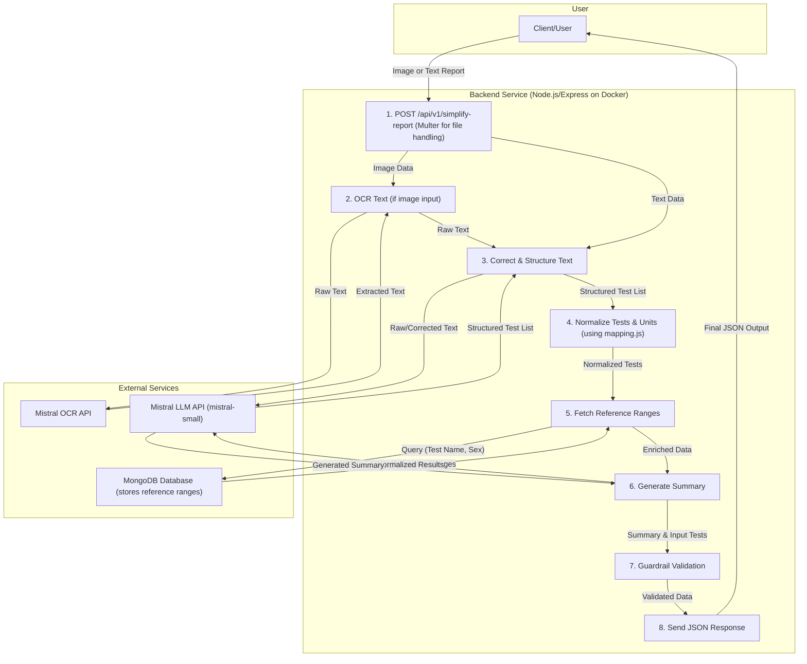

# AI-Powered Medical Report Simplifier

## Project Overview

This project is a backend service designed to demystify complex medical reports for patients. It accepts raw text or scanned lab reports, intelligently extracts key information, normalizes the data against standard reference ranges, and generates patient-friendly summaries. By leveraging Optical Character Recognition (OCR) and advanced Large Language Models (LLMs), it bridges the gap between clinical jargon and patient understanding, without providing diagnoses.

The core mission is to handle common issues like OCR errors and inconsistent terminology, producing a structured, reliable, and easy-to-understand output.

## Key Features

* **Multi-Format Input:** Accepts both raw text and image-based medical reports (`.png`, `.jpg`, `.webp`, etc.).
* **AI-Powered OCR:** Utilizes OCR.space API to accurately extract text from scanned documents.
* **Intelligent Error Correction:** Employs Mistral AI LLM to correct common OCR typos and transcription errors (e.g., "Hemglobin" -> "Hemoglobin").
* **Data Normalization:** Standardizes test names and units using a predefined mapping system to ensure consistency.
* **Reference Range Comparison:** Fetches appropriate reference ranges from a MongoDB database, with support for sex-specific ranges.
* **Patient-Friendly Summaries:** Generates simple, clear explanations using Mistral AI LLM.
* **Anti-Hallucination Guardrails:** Includes a critical safety check to ensure the AI-generated summary only contains information present in the original report.
* **Modular API:** Provides separate endpoints for each processing step, allowing flexible integration.
* **Dockerized Environment:** The entire application is containerized with Docker for easy setup and deployment.

## Architecture & How It Works

The service processes reports through a multi-step pipeline with dedicated API endpoints for each step:

### Processing Pipeline:

1. **OCR & Text Extraction** (`/api/v1/extract-text`)
   - Accepts image files or raw text input
   - Uses Mistral OCR API for image-to-text conversion
   - Applies Mistral AI for text parsing and error correction
   - Returns structured test data with confidence scores

2. **Data Normalization** (`/api/v1/normalize-tests`)
   - Standardizes test names using mapping constants
   - Fetches reference ranges from MongoDB database
   - Supports sex-specific reference ranges
   - Returns normalized test objects with status indicators

3. **Summary Generation** (`/api/v1/simple-summary`)
   - Generates patient-friendly explanations using Mistral AI
   - Implements guardrails to prevent AI hallucinations
   - Cross-references generated content with original test data
   - Returns structured summaries and explanations

4. **Complete Processing** (`/api/v1/simplify-report`)
   - End-to-end processing combining all steps
   - Single endpoint for full medical report simplification
   - Returns comprehensive results with tests and summary

### Architecture Diagram 


### Tech Stack

* **Backend:** Node.js (ES Modules), Express
* **AI Services:** 
  - Mistral AI (`mistral-small`) for text processing and summarization
  - Mistral OCR API for optical character recognition
* **Database:** MongoDB with reference ranges collection
* **File Handling:** Multer for multipart form data
* **Containerization:** Docker with docker-compose
* **Development:** Nodemon for hot reloading

## Prerequisites

Before you begin, ensure you have the following:

* **Node.js** (v18 or higher) & **npm**
* **Docker** and **Docker Compose**
* **MongoDB:** A running MongoDB instance (local or remote)
* **API Keys:**
  - Mistral AI API key
  - OCR.space API key

## Installation & Setup

### 1. Clone the repository
```bash
git clone https://github.com/DharunThota/Medical-Report-Simplifier.git
cd Medical-Report-Simplifier/server
```

### 2. Configure Environment Variables
Create a `.env` file in the `server/` directory using the provided template:
```bash
cp .env.template .env
```

Edit the `.env` file with your credentials:
```env
PORT=3000
MONGODB_URI=mongodb://localhost:27017/medical_reports
MONGODB_DB_NAME=report_simplifier
MONGODB_COLLECTION_NAME=reference_ranges
MISTRAL_API_KEY=your_mistral_api_key_here
```

### 3. Install Dependencies
```bash
npm install
```

### 4. Run with Docker (Recommended)
```bash
# Build and run the application
docker-compose up --build

# Run in detached mode
docker-compose up --build -d

# Stop the application
docker-compose down
```

### 5. Run Locally (Development)
```bash
# Make sure MongoDB is running locally
npm start

# For development with hot reload
npm run dev
```

The server will be available at `http://localhost:3000`

### 6. Populate Database (Optional)
Use the Python scraper to populate your database with reference ranges:
```bash
cd ../scraper
pip install -r requirements.txt
python scraper.py
```

## API Documentation

### Base URLs
```
# Local development
http://localhost:3000

# Live testing server
http://74.225.185.74:3000
```

> 🌐 **Live Demo:** You can test the API directly at `http://74.225.185.74:3000` without setting up locally!

### 1. Extract Text from Medical Report
**Endpoint:** `POST /api/v1/extract-text`  
**Description:** Extracts and parses text from medical reports (images or raw text)

**Content-Type:** `multipart/form-data`

**Form Data Fields:**
- `reportImage` (File): Image file of the report (`.png`, `.jpg`, `.webp`, etc.)
- `text` (String): Raw text from the report
- `sex` (String, Optional): Patient's biological sex (`male` or `female`)

**Response:**
```json
{
  "tests_raw": [
    "Hemoglobin 10.2 g/dL (Low)",
    "WBC 11200 /uL (High)"
  ],
  "confidence": 0.9
}
```

### 2. Normalize Test Results
**Endpoint:** `POST /api/v1/normalize-tests`  
**Description:** Normalizes extracted tests against reference ranges from database

**Content-Type:** `multipart/form-data`

**Form Data Fields:**
- `reportImage` (File): Image file of the report
- `text` (String): Raw text from the report
- `sex` (String, Optional): Patient's biological sex for gender-specific ranges

**Response:**
```json
{
  "tests": [
    {
      "name": "Hemoglobin",
      "value": 10.2,
      "unit": "g/dL",
      "status": "low",
      "ref_range": {
        "low": 12.0,
        "high": 15.5
      }
    }
  ],
  "status": "ok"
}
```

### 3. Generate Patient Summary
**Endpoint:** `POST /api/v1/simple-summary`  
**Description:** Creates patient-friendly summaries and explanations

**Content-Type:** `multipart/form-data`

**Form Data Fields:**
- `reportImage` (File): Image file of the report
- `text` (String): Raw text from the report  
- `sex` (String, Optional): Patient's biological sex

**Response:**
```json
{
  "summaryData": {
    "summary": "Your Hemoglobin level is low and your white blood cell count is high.",
    "explanations": [
      "Hemoglobin carries oxygen in your blood. A low level might indicate anemia.",
      "White blood cells help fight infections. A high count might indicate your body is fighting an infection."
    ]
  },
  "normalizedTests": [...] // Same structure as normalize-tests
}
```

### 4. Complete Report Processing (Main Endpoint)
**Endpoint:** `POST /api/v1/simplify-report`  
**Description:** End-to-end processing of medical reports with full analysis

**Content-Type:** `multipart/form-data`

**Form Data Fields:**
- `reportImage` (File): Image file of the report
- `text` (String): Raw text from the report
- `sex` (String, Optional): Patient's biological sex (`male` or `female`)

*(Provide either `reportImage` or `text`, not both)*

**Successful Response (200 OK):**
```json
{
  "tests": [
    {
      "name": "Hemoglobin",
      "value": 10.2,
      "unit": "g/dL", 
      "status": "low",
      "ref_range": {
        "low": 12.0,
        "high": 15.5
      }
    },
    {
      "name": "WBC",
      "value": 11200,
      "unit": "/uL",
      "status": "high", 
      "ref_range": {
        "low": 4000,
        "high": 11000
      }
    }
  ],
  "summary": "Your Hemoglobin level is low and your white blood cell count is high.",
  "status": "ok"
}
```

**Error Response (400 Bad Request):**
```json
{
  "status": "unprocessed",
  "reason": "No valid test results could be extracted from the input."
}
```

**Error Response (500 Internal Server Error):**
```json
{
  "error": "Failed to parse and correct raw text."
}
```

## Project Structure

```
server/
├── app.js                 # Main Express application
├── package.json           # Dependencies and scripts
├── Dockerfile            # Docker configuration
├── docker-compose.yml    # Container orchestration
├── .env                  # Environment variables (create from .env.template)
├── .env.template         # Environment variables template
├── constants/
│   └── mapping.js        # Test name standardization mappings
├── database/
│   └── db.js            # MongoDB connection and queries
├── processor/
│   ├── ocrProcessor.js   # OCR.space API integration
│   ├── parseProcessor.js # Text parsing and error correction
│   ├── normalizeProcessor.js # Test normalization logic
│   └── summaryProcessor.js   # AI summary generation
├── router/
│   └── reportRouter.js   # API route definitions
└── utils/
    ├── aiClients.js      # Mistral AI client configuration
    └── helpers.js        # Utility functions
```

## Database Schema

The service uses a MongoDB collection with reference ranges structured as follows:

```json
{
  "_id": ObjectId("..."),
  "name": "Hemoglobin",           // Standardized test name
  "unit": "g/dL",                 // Standard unit for this test
  "category": "Complete Blood Count",
  "ref_range": {
    "male": { "low": 13.5, "high": 17.5 },
    "female": { "low": 12.0, "high": 15.5 },
    "general": { "low": 12.0, "high": 17.5 }  // Fallback range
  }
}
```

## Environment Variables

Required environment variables in your `.env` file:

```env
# Server Configuration
PORT=3000
NODE_ENV=development

# Database
MONGODB_URI=mongodb://localhost:27017/report_simplifier

# AI Services
MISTRAL_API_KEY=your_mistral_api_key_here
```

## Docker Usage

### Build and Run
```bash
# Simple build and run
docker-compose up --build

# Run in background
docker-compose up --build -d

# View logs
docker-compose logs -f

# Stop application
docker-compose down
```

### Manual Docker Commands
```bash
# Build image
docker build -t medical-report-simplifier .

# Run with environment file
docker run -p 3000:3000 --env-file .env medical-report-simplifier
```
## Development

### Local Development Setup
```bash
# Install dependencies
npm install

# Start development server with hot reload
npm run dev

# Start production server
npm start
```

### Testing API Endpoints

You can test the API using curl, Postman, or any HTTP client:

```bash
# Test with raw text (local)
curl -X POST http://localhost:3000/api/v1/simplify-report \
  -F "text=Hemoglobin 10.2 g/dL Low, WBC 11200 /uL High" \
  -F "sex=female"

# Test with raw text (live server)
curl -X POST http://74.225.185.74:3000/api/v1/simplify-report \
  -F "text=Hemoglobin 10.2 g/dL Low, WBC 11200 /uL High" \
  -F "sex=female"

# Test with image file (local)
curl -X POST http://localhost:3000/api/v1/simplify-report \
  -F "reportImage=@path/to/your/report.jpg;type=image/jpeg" \
  -F "sex=male"

# Test with image file (live server)
curl -X POST http://74.225.185.74:3000/api/v1/simplify-report \
  -F "reportImage=@path/to/your/report.jpg;type=image/jpeg" \
  -F "sex=male"
```

💡 **Note:** Make sure to specify the correct MIME type (`;type=image/jpeg`, `;type=image/png`, `;type=image/webp`) when uploading images to avoid OCR processing errors.

## Troubleshooting

### Common Issues

1. **MongoDB Connection Error**
   - Ensure MongoDB is running locally or check your `MONGODB_URI`
   - Verify database permissions

2. **API Key Errors**
   - Check that your Mistral AI API key is valid
   - Ensure `.env` file is in the correct location

3. **OCR Processing Issues**
   - Supported formats: PNG, JPG, JPEG, WEBP
   - Maximum file size depends on Mistral AI plan limits

4. **Docker Build Issues**
   - Ensure Docker is running
   - Check that all required files exist (package.json, app.js, etc.)

### Logs and Debugging

```bash
# View application logs
docker-compose logs -f app

# Check MongoDB connection
docker-compose logs mongodb

# Debug locally
NODE_ENV=development npm run dev
```

## Acknowledgments

* **Reference Range Data:** Sourced from [Medscape](https://emedicine.medscape.com/)
* **AI and OCR Services:** Powered by [Mistral AI Platform](https://mistral.ai/)
